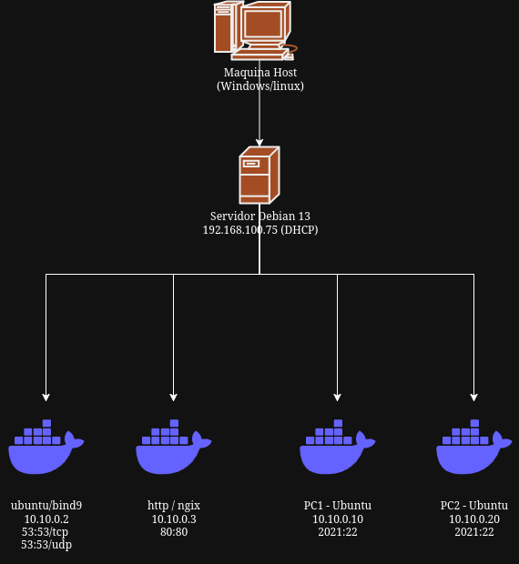
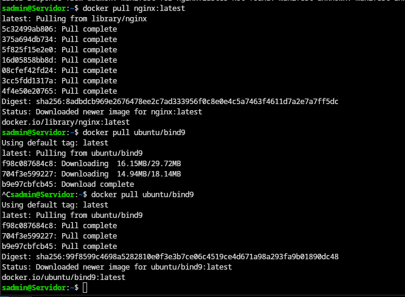
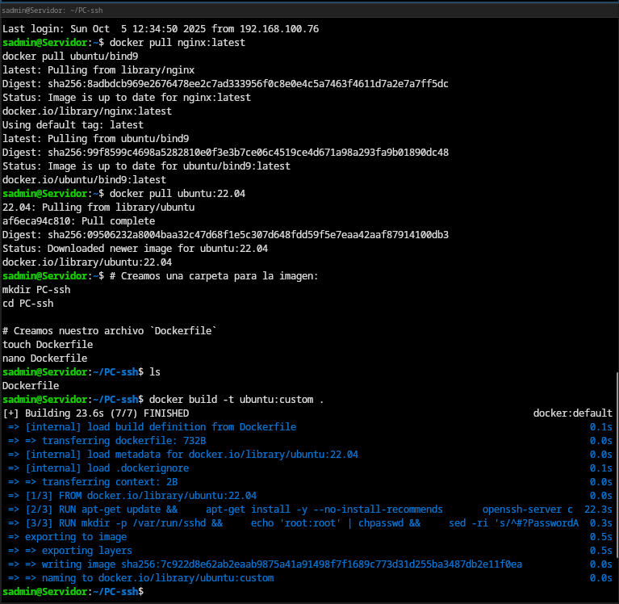
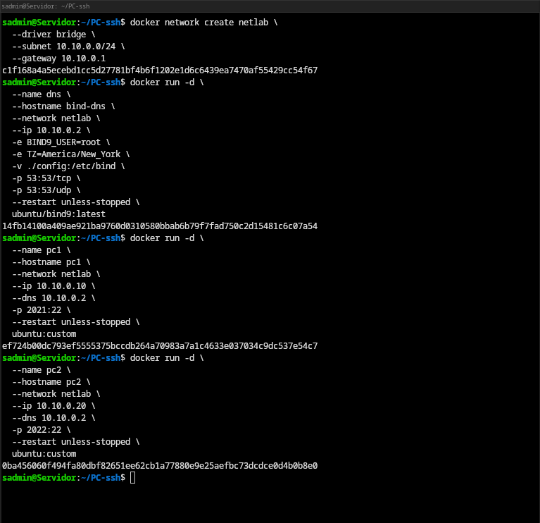
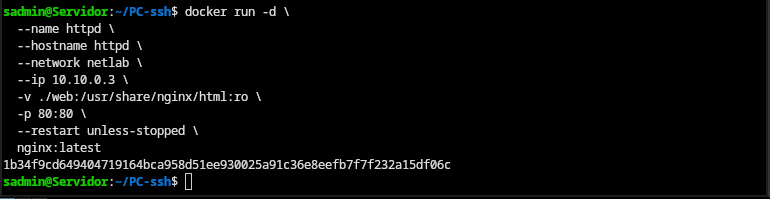
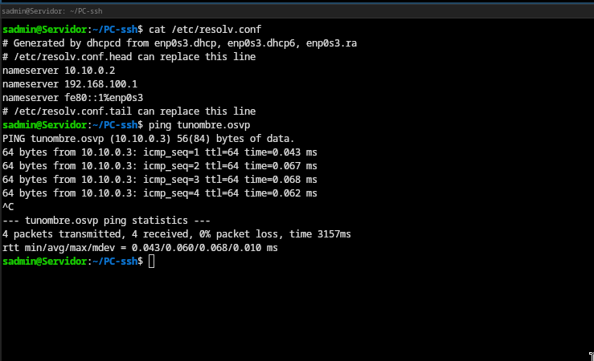
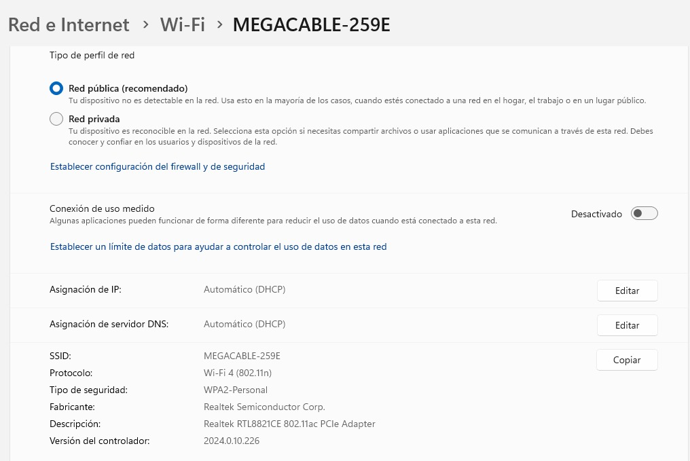
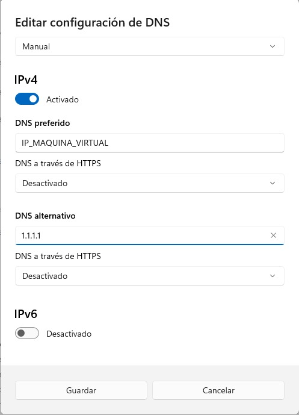
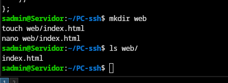

# Servidor DNS con Docker 

> **Objetivo:** Aprender a montar un laboratorio DNS con contenedores Docker paso a paso.

---

##  Antes de empezar

### Requisitos previos
- Tener **Docker** instalado y funcionando en tu **máquina virtual Linux (Debian o Ubuntu)**.
- Conocer comandos básicos de terminal: `cd`, `mkdir`, `nano`, `sudo`, etc.
- Estar dentro del usuario con permisos para usar Docker.

Si al ejecutar `docker ps` te aparece el error de permisos, haz esto:
```bash
su -
usermod -aG docker sadmin   # cambia 'sadmin' por tu usuario real
exit
```

---

##  Estructura del laboratorio

Vamos a crear **4 contenedores** conectados a una red Docker llamada `netlab`.

| Componente | Imagen          | IP         | Puerto              | Descripción |
|-------------|-----------------|------------|---------------------|--------------|
| DNS         | ubuntu/bind9    | 10.10.0.2  | 53/tcp, 53/udp      | Servidor DNS que resolverá los nombres |
| HTTP        | nginx           | 10.10.0.3  | 80/tcp              | Servidor web para probar la resolución |
| PC1         | ubuntu:custom   | 10.10.0.10 | 2021:22             | Cliente 1 que consultará el DNS |
| PC2         | ubuntu:custom   | 10.10.0.20 | 2022:22             | Cliente 2 que consultará el DNS |

Topología de red:



---

## Paso 1: Crear carpeta base

Ejecuta esto en tu **máquina virtual Linux (no en un contenedor):**
```bash
mkdir ~/lab-dns
cd ~/lab-dns
```

---

## Paso 2: Descargar imágenes necesarias

```bash
docker pull nginx:latest
docker pull ubuntu/bind9:latest
docker pull ubuntu:22.04
```


---

## Paso 3: Crear imagen personalizada con SSH

Creamos una imagen llamada **ubuntu:custom**, que incluye SSH para simular una PC con acceso remoto.

```bash
mkdir PC-ssh && cd PC-ssh
touch Dockerfile
nano Dockerfile
```

Pega este contenido:
```dockerfile
FROM ubuntu:22.04

# Actualiza e instala OpenSSH y utilidades básicas
RUN apt-get update && \
    apt-get install -y --no-install-recommends \
      openssh-server curl iputils-ping vim ca-certificates && \
    rm -rf /var/lib/apt/lists/*

# Configura SSH
RUN mkdir -p /var/run/sshd && \
    echo 'root:root' | chpasswd && \
    sed -ri 's/^#?PasswordAuthentication .*/PasswordAuthentication yes/' /etc/ssh/sshd_config && \
    sed -ri 's/^#?PermitRootLogin .*/PermitRootLogin yes/' /etc/ssh/sshd_config && \
    echo "AcceptEnv LANG LC_*" >> /etc/ssh/sshd_config

# Expone el puerto SSH
EXPOSE 22

# Ejecuta SSHD en foreground (para mantener el contenedor vivo)
CMD ["/usr/sbin/sshd", "-D"]

```

Compila la imagen:
```bash
docker build -t ubuntu:custom .
```

Captura del proceso de construcción:


---

## Paso 4: Configurar los archivos del DNS

Regresa a la carpeta principal del laboratorio:
```bash
cd ~/lab-dns
mkdir config
```

Crea los archivos de configuración:
```bash
touch config/{named.conf,internal.TU_NOMBRE.osvp,external.TU_NOMBRE.osvp}
```
>  Sustituye **TU_NOMBRE** por tu nombre (por ejemplo: `ninjago.osvp`).
>  No uses mayusculas en el el nombre o dará error

### `named.conf`
```bash
options {
    directory "/var/cache/bind";
    recursion yes;
    allow-query { any; };
    forwarders { 1.1.1.1; 8.8.8.8; };
    dnssec-validation no;
    listen-on { any; };
    listen-on-v6 { any; };
};

view "internal" {
    match-clients { 10.10.0.0/24; localhost; localnets; };

    zone "TU_NOMBRE.osvp" IN {
        type master;
        file "/etc/bind/internal.TU_NOMBRE.osvp";
    };
};

view "external" {
    match-clients { any; };

    zone "TU_NOMBRE.osvp" IN {
        type master;
        file "/etc/bind/external.TU_NOMBRE.osvp";
    };
};
```

### `internal.TU_NOMBRE.osvp`
```dns-zone-file
$TTL 1h
@   IN SOA ns1.TU_NOMBRE.osvp. admin.TU_NOMBRE.osvp. (
        2025092401 ; serial
        1h         ; refresh
        15m        ; retry
        1w         ; expire
        1h )       ; minimum

    IN NS ns1.TU_NOMBRE.osvp.

ns1 IN A 10.10.0.2
@    IN A 10.10.0.3
www  IN A 10.10.0.3
pc1  IN A 10.10.0.10
pc2  IN A 10.10.0.20
```

### `external.TU_NOMBRE.osvp`
```dns-zone-file
$TTL 1h
@   IN SOA ns1.TU_NOMBRE.osvp. admin.TU_NOMBRE.osvp. (
        2025092501 ; serial
        1h 15m 1w 1h )

    IN NS ns1.TU_NOMBRE.osvp.

ns1 IN A IP_MAQUINA_VIRTUAL
@    IN A IP_MAQUINA_VIRTUAL
www  IN A IP_MAQUINA_VIRTUAL
pc1  IN A IP_MAQUINA_VIRTUAL
pc2  IN A IP_MAQUINA_VIRTUAL
```
> Reemplaza **IP_MAQUINA_VIRTUAL** por la IP real de tu VM (ejemplo: 192.168.56.101).

---

##  Paso 5: Crear red Docker

```bash
docker network create netlab \
  --driver bridge \
  --subnet 10.10.0.0/24 \
  --gateway 10.10.0.1
```
Verifica:
```bash
docker network inspect netlab | grep Subnet
```

---

##  Paso 6: Crear contenedores manualmente

### DNS (bind9)
```bash
docker run -d --name dns --hostname bind-dns \
  --network netlab --ip 10.10.0.2 \
  -v ./config:/etc/bind \
  -p 53:53/tcp -p 53:53/udp \
  ubuntu/bind9:latest
```

### PC1 y PC2
```bash
docker run -d --name pc1 --hostname pc1 \
  --network netlab --ip 10.10.0.10 \
  --dns 10.10.0.2 -p 2021:22 ubuntu:custom

docker run -d --name pc2 --hostname pc2 \
  --network netlab --ip 10.10.0.20 \
  --dns 10.10.0.2 -p 2022:22 ubuntu:custom
```

### Servidor HTTP
```bash
mkdir web
echo "<h1>Hola soy TU_NOMBRE</h1>" > web/index.html

docker run -d --name httpd --hostname httpd \
  --network netlab --ip 10.10.0.3 \
  -v ./web:/usr/share/nginx/html:ro \
  -p 80:80 nginx:latest
```





---

## Paso 7: (Alternativo) Usar Docker Compose

Crea el archivo `docker-compose.yml`:
```bash
touch docker-compose.yml
```
Pega esto dentro:
```yaml
services:
  dns:
    image: ubuntu/bind9:latest
    container_name: dns
    ports:
      - "53:53/tcp"
      - "53:53/udp"
    volumes:
      - ./config:/etc/bind
    networks:
      netlab:
        ipv4_address: 10.10.0.2

  pc1:
    image: ubuntu:custom
    container_name: pc1
    networks:
      netlab:
        ipv4_address: 10.10.0.10
    dns: [10.10.0.2]
    ports: ["2021:22"]

  pc2:
    image: ubuntu:custom
    container_name: pc2
    networks:
      netlab:
        ipv4_address: 10.10.0.20
    dns: [10.10.0.2]
    ports: ["2022:22"]

  http:
    image: nginx:latest
    container_name: httpd
    networks:
      netlab:
        ipv4_address: 10.10.0.3
    volumes:
      - ./web:/usr/share/nginx/html:ro
    ports: ["80:80"]

networks:
  netlab:
    driver: bridge
    ipam:
      config:
        - subnet: 10.10.0.0/24
          gateway: 10.10.0.1
```

Ejecuta:
```bash
docker compose up -d
```
---

## Añadir DNS a maquina host:

### En linux: 

Añade la siguiente línea en el archivo `/etc/resolve.conf` :

```bash
# Maquina virtual:
nameserver 10.10.0.2
#Maquina real (Si usas linux):
nameserver IP_MAQUINA_VIRTUAL
```

### En Windows:

**Nota**: Modifica la red en la que te encuentras




---

## Paso 8: Probar el DNS

### Desde el host (tu máquina virtual):
```bash
nslookup www.TU_NOMBRE.osvp 10.10.0.2
```

### Desde dentro de PC1 o PC2:
```bash
docker exec -it pc1 bash
ping www.TU_NOMBRE.osvp
```

---

##  Paso 9: Verificar todo

Lista contenedores activos:
```bash
docker ps
```
Ver IPs:
```bash
docker network inspect netlab | grep IPv4Address
```

 Ejemplo:


---

## ¡Laboratorio listo!

Tu entorno debería verse así:
- `dns` resolviendo nombres del dominio `TU_NOMBRE.osvp`
- `pc1` y `pc2` accediendo al sitio web `www.TU_NOMBRE.osvp`
- `httpd` mostrando la página personalizada en el navegador.

---

>  **Consejo final:** si algo no responde, usa `docker logs <nombre_contenedor>` para ver el error.
